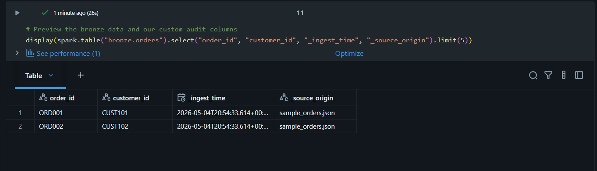

# DE-supply-chain-analytics
End-to-end Data Engineering project: Real-time supply chain intelligence using Azure Databricks, Unity Catalog, and dbt.

# Real-Time Supply Chain Intelligence Platform

## Project Overview
This project builds an end-to-end cloud data pipeline to improve supply chain visibility and operational efficiency. Using a Medallion Architecture (Bronze, Silver, Gold), the platform processes orders, inventory, shipment, and supplier data to identify delays, monitor stock levels, and evaluate vendor performance.

## Objective
The goal of this project is to simulate a modern data engineering solution for a real-time supply chain use case. The platform is designed to support raw ingestion, data transformation, governance, and AI-powered insights.

## Business Problem
Supply chain teams often lack timely visibility into delayed shipments, low inventory, and supplier performance. This project aims to consolidate source data into a governed analytics platform so these issues can be monitored and analyzed more effectively.

## Architecture Overview
The project follows a Medallion Architecture pattern:
- **Bronze**: Raw ingestion of source data with minimal transformation.
- **Silver**: Cleaning, standardization, and enrichment of source data.
- **Gold**: Aggregated business-ready tables for reporting and analytics.

---

## Phase 1: Data Sourcing & Bronze Ingestion
Before building the pipeline, we identified the key data sources required for supply chain visibility. This phase focuses on defining the origin, frequency, and purpose of the data.

### Data Domains & Strategy
| Source | Data Type | Refresh Frequency | Purpose |
| :--- | :--- | :--- | :--- |
| **Orders** | Transactional | Daily Batch | Tracks customer demand and fulfillment lifecycle. |
| **Inventory** | Snapshot | Hourly | Monitors stock levels across warehouses to help prevent stockouts. |
| **Shipments** | Event | Near Real-Time | Tracks shipment status updates for delay analysis. |
| **Suppliers** | Master/Reference | Weekly | Provides vendor details for supplier performance analysis. |

### Key Architectural Decisions
- **Raw Retention**: The Bronze layer stores source data in its raw form with minimal transformation to support auditability and reprocessing.
- **Decoupled Sourcing**: Reference data such as suppliers is managed separately from transactional data to improve clarity and maintainability.
- **Hybrid Ingestion**: The design supports both batch-style data and frequent event-driven updates.

---

## Bronze Ingestion Completed
Implemented the raw data landing zone using senior-level engineering patterns in Azure Databricks.

### Key Deliverables
| Component | Status | Description |
|-----------|--------|-------------|
| **Source Schemas** | Defined | PySpark `StructType` schemas for all four domains. |
| **Bronze Delta Tables** | Created | Successfully created and populated `bronze.orders`, `bronze.inventory`, `bronze.shipments`, and `bronze.suppliers`. |
| **Ingestion Pipeline** | Serverless-Ready | Python-native JSON parsing to support Databricks Serverless compute. |
| **Data Quality** | Automated | Centralized DQ checks for null validation and record counts. |
| **Performance** | Optimized | Delta Lake `OPTIMIZE` applied for file compaction and read efficiency. |

### Implementation Proof
The following screenshots confirm the successful deployment of the Bronze catalog and the verification of custom audit metadata:

**Bronze Catalog Overview** 


**Audit Metadata Verification** 




### Engineering Challenges & Resolutions
- **Serverless compute limitations**: Initial ingestion approach caused runtime issues in Databricks Serverless. This was resolved by switching to a Python-native parsing method that works reliably in the notebook environment.
- **Schema handling**: Source schemas were defined explicitly to ensure type consistency and avoid data quality issues during ingestion.
- **Auditability and lineage**: Each record includes ingest metadata to support traceability and troubleshooting in downstream layers.

### Sample Bronze Queries
```sql
-- Customer spend analysis (ready for Silver transformation)
SELECT customer_id, SUM(total_amount) AS total_spent
FROM bronze.orders
GROUP BY customer_id;

-- Inventory health check
SELECT warehouse_location, AVG(stock_level) AS avg_stock
FROM bronze.inventory
GROUP BY warehouse_location;
```

## Tools and Technologies
- Azure Databricks
- Delta Lake
- Unity Catalog
- GitHub
- VS Code
- PySpark (Python)
- SQL
- dbt Core (later phase)
- AI/RAG integration (later phase)

## Learning Outcomes
By completing this project, I will demonstrate:
- Data sourcing and architecture planning
- Bronze, Silver, and Gold design principles
- Data governance concepts using Unity Catalog
- Portfolio-ready documentation
- AI integration with governed data

## Project Status
- [x] Environment setup
- [x] Project planning and data sourcing
- [x] Phase 1: Bronze Ingestion
- [ ] Phase 2: Silver Transformation
- [ ] Phase 3: Gold Aggregation
- [ ] Phase 4: Governance
- [ ] Phase 5: AI Integration

## Notes
This project is being built as a portfolio piece to demonstrate practical modern data engineering skills in Azure Databricks.

## Author
Mahesh Boyapati