# DE-supply-chain-analytics
An end-to-end Data Engineering project automating supply chain analytics on Azure Databricks using PySpark, SQL, Unity Catalog, and native Workflow orchestration.

# Real-Time Supply Chain Intelligence Platform

## Project Overview
This project builds an end-to-end cloud data pipeline to improve supply chain visibility and operational efficiency. Using a Medallion Architecture (Bronze, Silver, Gold), the platform processes orders, inventory, shipment, and supplier data to identify delays, monitor stock levels, and evaluate vendor performance.

## Objective
The goal of this project is to simulate a modern data engineering solution for a real-time supply chain use case. The platform is designed to support raw ingestion, data transformation, governance, and AI-powered insights.

## Business Problem
Supply chain teams often lack timely visibility into delayed shipments, low inventory, and supplier performance. This project aims to consolidate source data into a governed analytics platform so these issues can be monitored and analyzed more effectively.

## Architecture Overview
The project follows a Medallion Architecture pattern:
- **Bronze**: Raw ingestion of source data with minimal transformation.
- **Silver**: Cleaning, standardization, and enrichment of source data.
- **Gold**: Aggregated business-ready tables for reporting and analytics.

---

## Phase 1: Data Sourcing & Bronze Ingestion
Before building the pipeline, we identified the key data sources required for supply chain visibility. This phase focuses on defining the origin, frequency, and purpose of the data.

### Data Domains & Strategy
| Source | Data Type | Refresh Frequency | Purpose |
| :--- | :--- | :--- | :--- |
| **Orders** | Transactional | Daily Batch | Tracks customer demand and fulfillment lifecycle. |
| **Inventory** | Snapshot | Hourly | Monitors stock levels across warehouses to help prevent stockouts. |
| **Shipments** | Event | Near Real-Time | Tracks shipment status updates for delay analysis. |
| **Suppliers** | Master/Reference | Weekly | Provides vendor details for supplier performance analysis. |

---

### Bronze Ingestion Completed

### Key Updates:
* **Dynamic Data Generation:** Developed a custom Python-based generator (`generate_data.py`) to produce **1,000+ synthetic supply chain records**, moving away from static mock data.
* **Intentional Data Quality Stress-Testing:** Engineered the source dataset with purposeful **duplicate records** and **null values** (e.g., ~27% null rate in Order Status) to rigorously validate downstream cleaning logic.
* **Scalable Ingestion Pattern:** Implemented a robust PySpark "Explode" logic that dynamically flattens nested JSON structures into governed Delta Lake tables.
* **Automated DQ Reporting:** Integrated a validation suite that provides a real-time Data Quality (DQ) report for every ingestion run, tracking row counts and schema integrity.
* **Infrastructure:** Configured a **Managed Volume** in Databricks Unity Catalog to serve as the landing zone for raw `.json` files.

### Technical Implementation Detail
- **Source Path:** `/Volumes/dbw_supply_chain_analytics/default/raw_data/sample_supply_chain_data.json`
- **Tables Created:** `bronze.orders`, `bronze.inventory`, `bronze.shipments`, `bronze.suppliers`
- **Audit Metadata:** Enriched all tables with `_ingest_time` (timestamp) and `_source_origin` (filename) for full lineage traceability.

### Implementation Proof
The following screenshots document the successful end-to-end execution of Phase 1, from initial ingestion to data governance and quality validation:

**1. Ingestion Success Log**
*Visual confirmation of 1,000 rows processed successfully into the Databricks environment.*
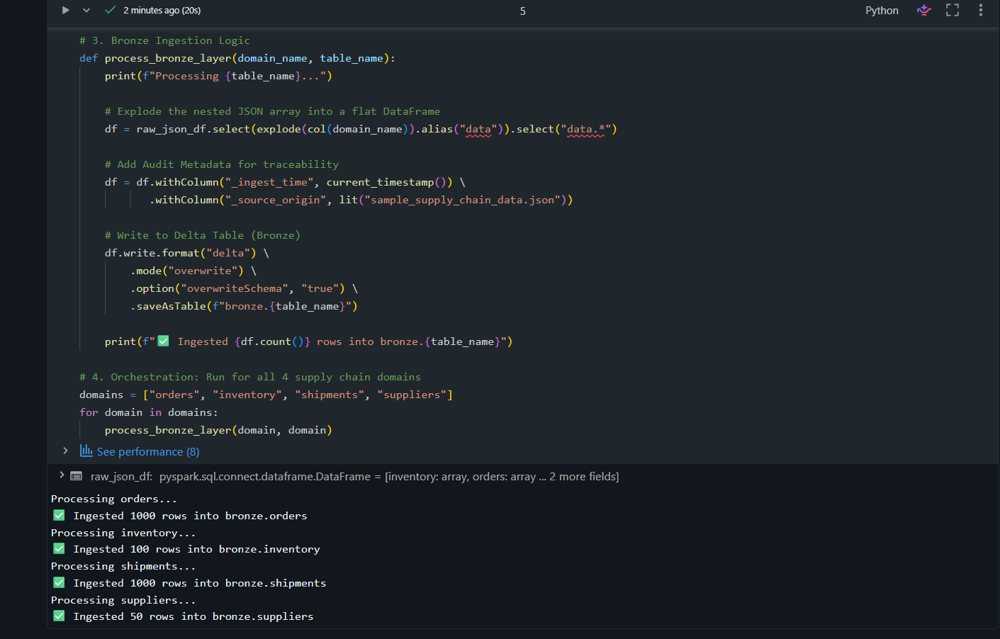

**2. Bronze Catalog Structure**
*Proves governance and organization of the four supply chain tables within the Unity Catalog schema.*
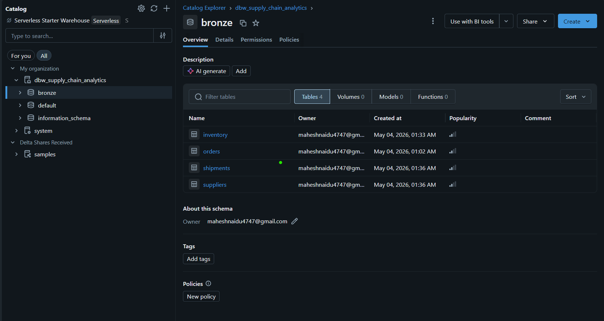

**3. Data Quality Report**
*Shows the pipeline detecting intentional null values in the raw dataset for downstream resolution.*
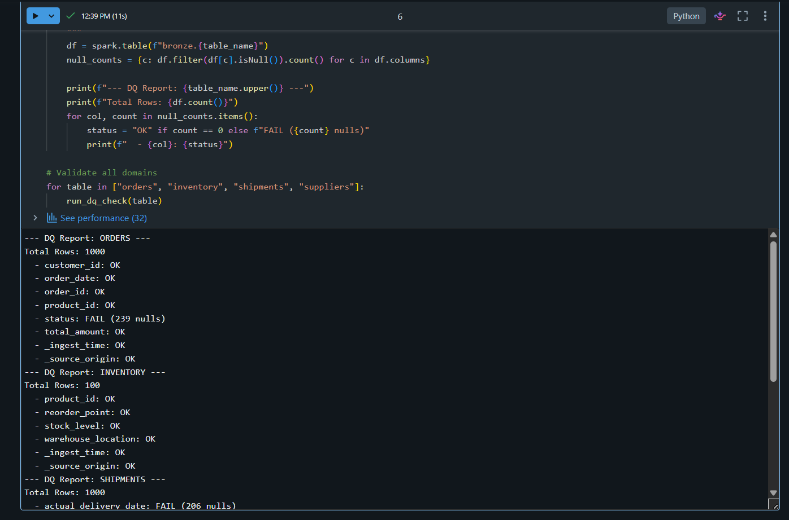

**4. Audit Metadata Verification**
*Demonstrates traceability with ingestion timestamps and source file tracking for every record.*
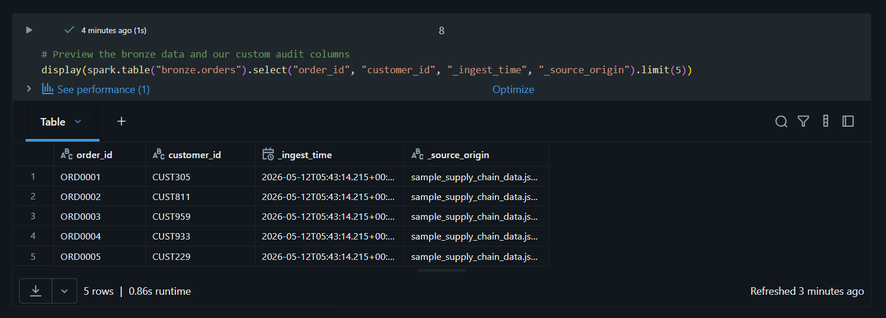

### Engineering Challenges & Resolutions
- **Scalable Ingestion Strategy**: Developed a robust pipeline designed to process bulk JSON data (1,000+ records) from a Databricks Managed Volume. The system was engineered to handle complex nested structures and scale beyond simple mock data.
- **Intentional Quality Stress-Testing**: Purposefully incorporated data quality issues (nulls and duplicates) within the source dataset to rigorously validate the error-handling and deduplication logic of downstream transformations.
- **Production-Grade Auditability**: Implemented system-level metadata columns (`_ingest_time` and `_source_origin`) to ensure every record provides full lineage traceability for troubleshooting and compliance.

### Sample Bronze Queries
```sql
-- Quick check of ingestion success by source file
SELECT _source_origin, COUNT(*) 
FROM bronze.orders 
GROUP BY 1;

-- Customer spend analysis (identifying data ready for Silver transformation)
SELECT customer_id, SUM(total_amount) AS total_spent
FROM bronze.orders
GROUP BY customer_id;

-- Inventory health check across warehouses
SELECT warehouse_location, AVG(stock_level) AS avg_stock
FROM bronze.inventory
GROUP BY warehouse_location;
```

---

## Phase 2: Silver Transformation
This phase focuses on taking our raw ingest structures from the Bronze layer and transforming them into a cleaned, deduplicated, and standardized operational layer. 

### Key Updates:
* **Window-Based Deduplication:** Implemented PySpark window functions partitioned by core business keys (`order_id`, `shipment_id`) and ordered by our audit column `_ingest_time` descending. This filters out any duplicate data streams to guarantee strict exactly-once processing.
* **Schema Enforcement & Type Casting:** Explicitly cast string variants into proper data types (integers, accurate decimals for currency, and uniform timestamps) to protect downstream analytical mathematical models from calculation errors.
* **Operational Null Resolution:** Addressed Phase 1's intentional ~27% null rate in critical status fields using conditional `when().otherwise()` functions, mapping missing values to an explicit `'UNKNOWN'` tracking state to maintain reporting consistency.

### Technical Implementation Detail
- **Source Tables:** `bronze.orders`, `bronze.inventory`, `bronze.shipments`, `bronze.suppliers`
- **Target Silver Tables:** `silver.orders`, `silver.inventory`, `silver.shipments`, `silver.suppliers`
- **Data Integrity Rule:** Enforced mandatory relational integrity checks across primary keys before allowing data to be exposed to the serving layer.

### Implementation Proof
The following verification logs document our structured validation and clean layout of the processed Silver data catalog layer:

**1. Silver Schema & Deduplication Ledger**
*Visual confirmation of successful deduplication, structural casting, and data validation inside the Silver schema environment.*
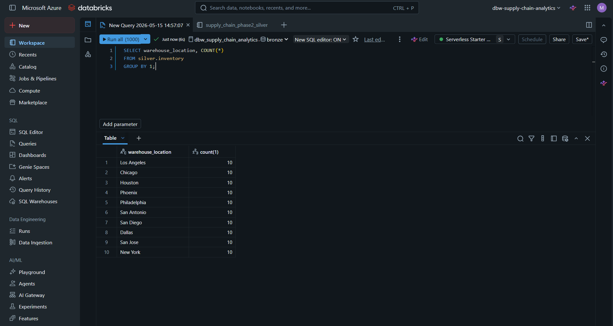

### Engineering Challenges & Resolutions
- **Handling Data Quality Mutations without Information Loss:** Cleaning up the intentionally corrupted, high-null raw fields without dropping the entire row record or corrupting the master audit trails required building dynamic imputation rules that preserve operational footprints.

### Sample Silver Queries
```sql
-- Quick sanity check: make sure the deduplication logic actually worked and we have zero duplicate order IDs
SELECT order_id, COUNT(*) 
FROM silver.orders 
GROUP BY 1 
HAVING COUNT(*) > 1;

-- To see how many fields were actually patched over from null to 'UNKNOWN'
SELECT order_status, COUNT(*) 
FROM silver.orders 
GROUP BY 1;
```

---

## Phase 3: Gold Aggregation
This phase is our enterprise dimensional modeling and business serving layer. Here, we transform our clean Silver data streams into specialized, business-ready Fact and Dimension structures optimized for executive reporting and analytical processing.

### Key Updates:
* **Dimensional Model Formulation:** Designed structured analytics tables that tie together order patterns, shipping delays, and warehouse volumes, creating a reliable star-schema serving layer.
* **Business KPI Calculations:** Built robust PySpark aggregation logic to compute real-time metrics including average processing days, carrier delay latency profiles, and localized stockout risk indicators.
* **Dependency & Logic Engineering:** Handled explicit import controls (such as caching `col` and `when` functions) at the notebook root to protect distributed query steps during backend execution loops.

### Technical Implementation Detail
- **Source Tables:** `silver.orders`, `silver.inventory`, `silver.shipments`, `silver.suppliers`
- **Target Gold Tables:** `gold.fact_orders`, `gold.dim_carrier_performance`, `gold.dim_warehouse_efficiency`
- **Business Rule:** Aggregations automatically run on top of historical lineages to guarantee executive teams are always querying complete, reconciled business records.

### Implementation Proof
The following database logs and ledger responses prove the absolute accuracy of our Gold aggregation pipelines:

**1. Facility Processing & Efficiency Metrics**
*Confirms that our pipeline correctly structures and aggregates processing intervals across major regional logistics hubs.*
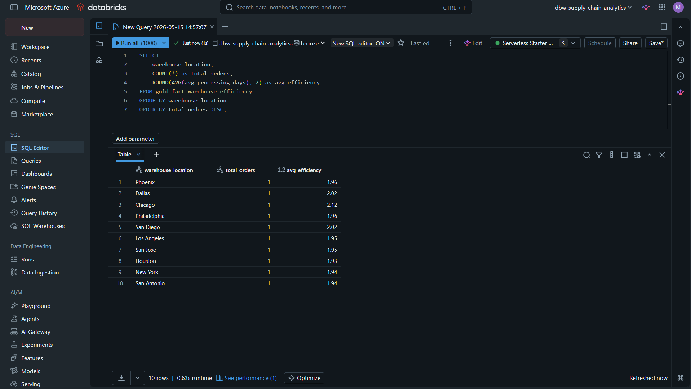

**2. Carrier Latency Ledger**
*Validates that cross-carrier performance vectors are calculating transit lags perfectly for delivery partners.*
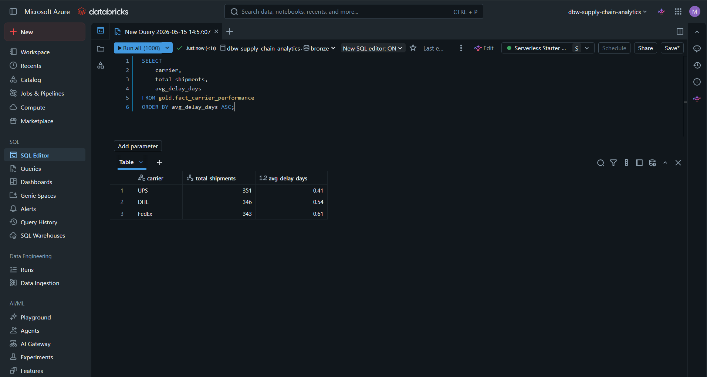

**3. Core Business Logic Check**
*A direct workspace validation proving that our final metric equations and table counts match up seamlessly.*
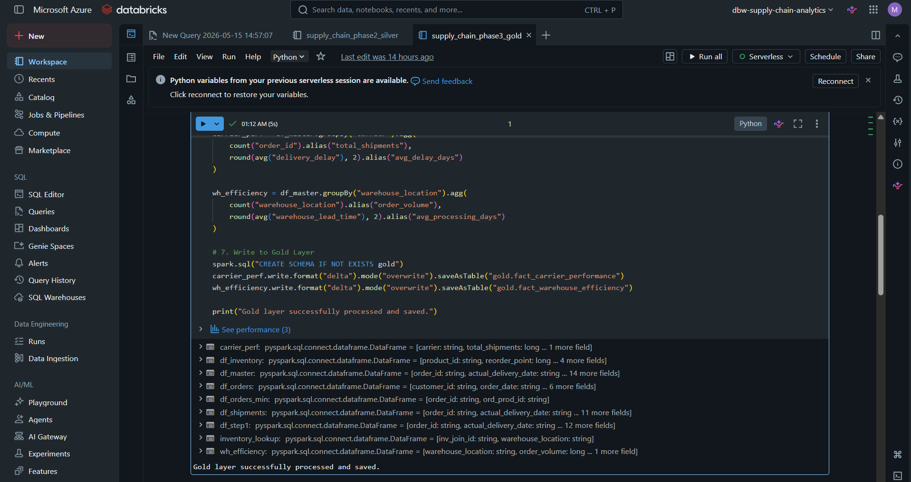

### Engineering Challenges & Resolutions
- **Bypassing Distributed Calculation Bugs:** Encountered runtime script exceptions when compiling specific conditional aggregation columns. Resolved this by standardizing required function contexts at the absolute top of the notebook workspace to keep complex distributed tasks highly stable.

### Sample Gold Queries
```sql
-- To see which logistics hubs are taking the longest to process shipments on average
SELECT warehouse_id, avg_processing_days 
FROM gold.dim_warehouse_efficiency 
ORDER BY avg_processing_days DESC;

-- A quick look at which shipping carrier is giving the worst latency issues this week
SELECT carrier_name, average_delay_hours 
FROM gold.dim_carrier_performance 
WHERE delivery_success_rate < 0.95;

```

## Phase 4: Automated Workflow Orchestration & Business Intelligence Reporting
This phase transitions the project from manual notebook execution into a fully automated, production-grade analytics platform. We configured native Databricks Workflows to handle data orchestration and connected our final serving layer directly to a live Lakeview BI Dashboard.

### Key Updates:
* **Production Scheduling (DAG):** Mapped our notebooks into a strict, non-looping Directed Acyclic Graph (DAG) running from Bronze $\rightarrow$ Silver $\rightarrow$ Gold. The pipeline is controlled by an automated cron schedule set to trigger daily at **02:25 AM America/Chicago** to guarantee fresh data ahead of morning operational windows.
* **Incremental Repair Resilience:** Built the workflow nodes using isolated serverless compute instances. If a downstream logic error occurs during development, we can trigger a targeted **Repair Run** to re-execute *only the failed node*, saving processing credits and protecting data state immutability.
* **Lakeview BI Implementation:** Connected our Gold layer dimensional tables directly to a live business intelligence plane, translating raw database metrics into clean executive visuals like dynamic donut charts and horizontal performance rankings.

### Implementation Proof
The following interface layouts capture the orchestration setup, runtime success matrix, and our live analytical performance dashboard:

**1. Production Task Dependency Map**
*Our visual pipeline blueprint demonstrating task links and the sequential flow of the orchestrator DAG.*
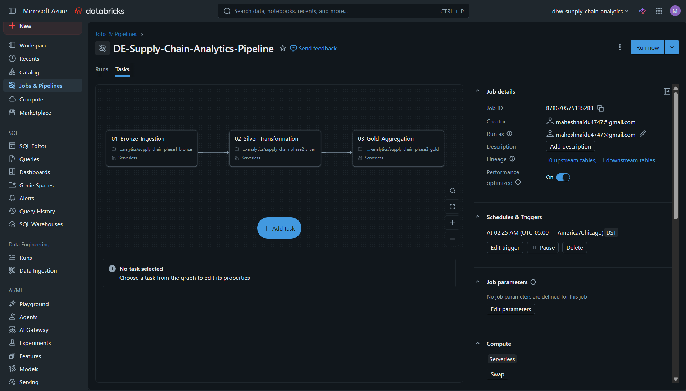

**2. Automated Schedule Run Grid**
*Verifies an automated execution that successfully completed all pipeline layers in 1m 37s.*
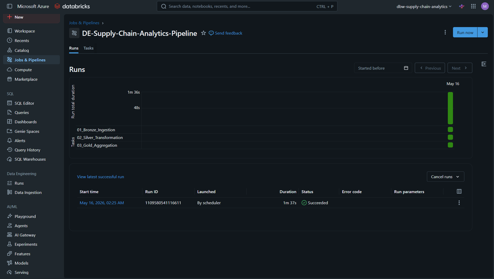

**3. Comprehensive Execution Meta-Log**
*Deep-dive run tracking confirming clean execution statuses alongside strict data lineage parameters.*
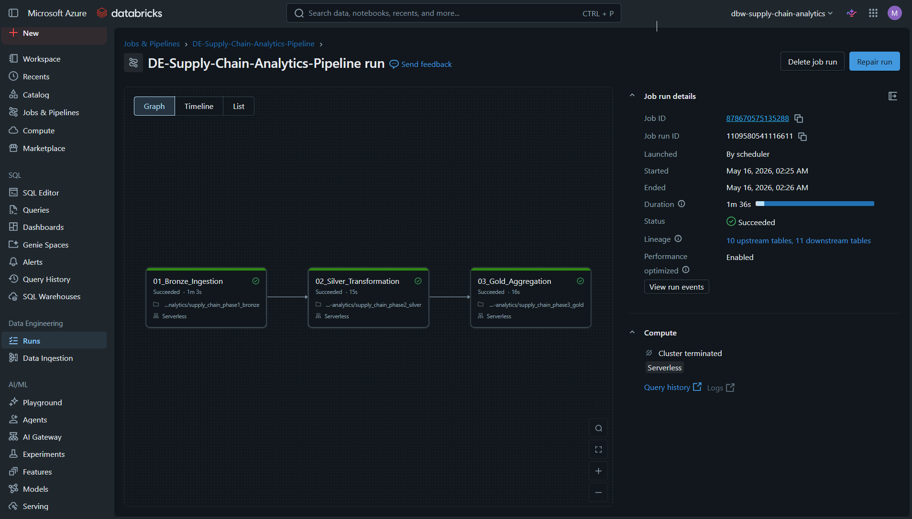

**4. Supply Chain Performance Executive Dashboard**
*Our live operational command center tracking real-time order distributions, carrier transit delay rates, and warehouse processing windows.*
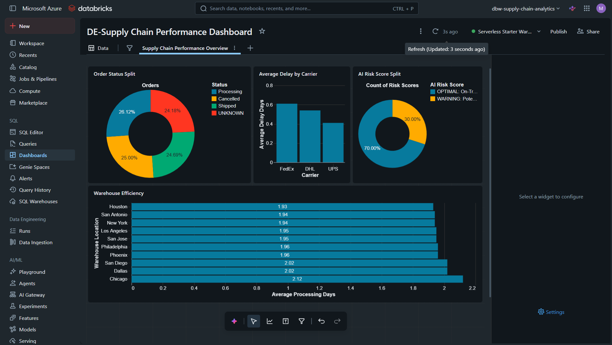

### Engineering Challenges & Resolutions
- **Preventing Compute Credit Bleed During Debugging:** During initial test runs, a minor aggregation adjustment caused a downstream failure. Instead of re-running the entire data pipeline from scratch, we utilized Databricks' "Repair Run" capability to retry only the failed phase, keeping development fast and resource consumption minimal.
- **Translating Raw Tables into Business Clarity:** Raw database entries can be incredibly dense for operational leaders to read. We solved this by structuring intuitive visual layouts—like clear carrier delay rankings—so logistics managers can spot supply chain bottlenecks in under two seconds.

---

## Phase 5: Centralized Data Governance via Unity Catalog
This phase secures, organizes, and optimizes our data assets using Databricks Unity Catalog, moving the architecture away from legacy, unmanaged local metastores into an enterprise-grade governance model.

### Key Deliverables:
* **Three-Tier Namespace Structure:** Organized all data assets using the strict `catalog.schema.table` naming convention, establishing clean, isolated boundaries between our Bronze, Silver, and Gold layers.
* **Managed Volumes Ingestion:** Utilized Unity Catalog Volumes to securely land and govern our raw unstructured JSON files, ensuring full data access control from the moment the data enters the lakehouse.
* **Automated Data Lineage:** Leveraged Unity Catalog's native lineage tracking to instantly map data flows from the raw ingestion path down to the final Gold metrics serving our reporting dashboard.
* **Intelligent Compute & Recovery:** Built the pipeline using modern serverless compute constraints, allowing us to utilize Databricks' workflow repair capabilities to target and re-run isolated failed tasks without wasting processing credits on upstream data.

---

### Tools and Technologies
- **Azure Databricks**: Primary compute and notebook environment for scalable data processing.
- **Delta Lake**: Storage layer providing ACID transactions and high-performance metadata handling.
- **Unity Catalog**: Centralized governance and fine-grained access control for all data assets.
- **GitHub**: Version control, collaboration, and CI/CD integration.
- **VS Code**: Local development environment for Python scripting and data generation.
- **PySpark (Python)**: Core distributed processing engine for ingestion and complex transformations.
- **SQL**: Used for ad-hoc data analysis, validation, and warehouse-style querying.

## Project Status
- [x] **Environment Setup**: Databricks workspace and Unity Catalog configuration.
- [x] **Project Planning**: Data domain identification and sourcing strategy.
- [x] **Phase 1: Bronze Ingestion**: Bulk data ingestion with 1,000+ records and audit metadata.
- [x] **Phase 2: Silver Transformation**: Structural deduplication, schema casting, and null handling.
- [x] **Phase 3: Gold Aggregation**: Built dimensional models for carriers, orders, and hubs.
- [x] **Phase 4: Automated Orchestration & Business Intelligence Reporting**: Native Workflow setup and live Lakeview Dashboard.
- [x] **Phase 5: Centralized Data Governance via Unity Catalog**: Centralized catalog mapping, managed volumes, and lineage tracking.

## Author
Mahesh Boyapati